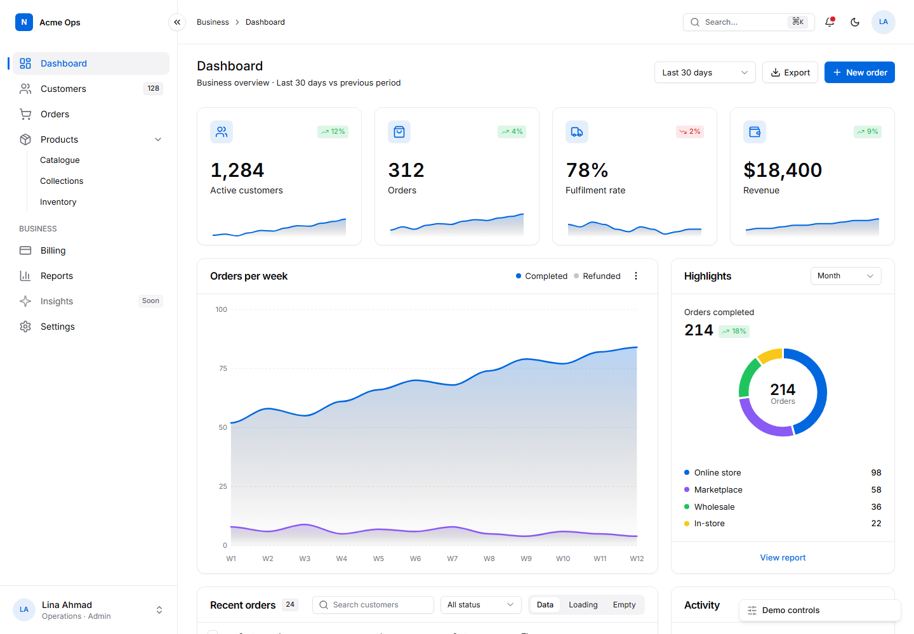
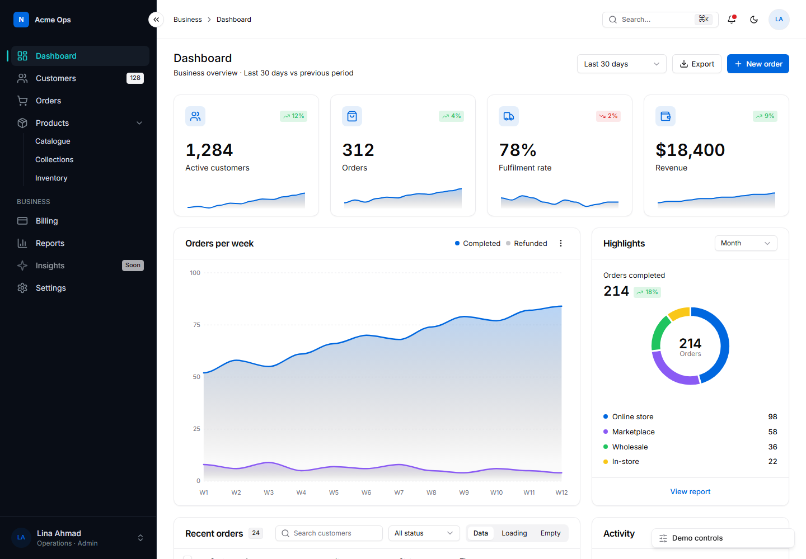
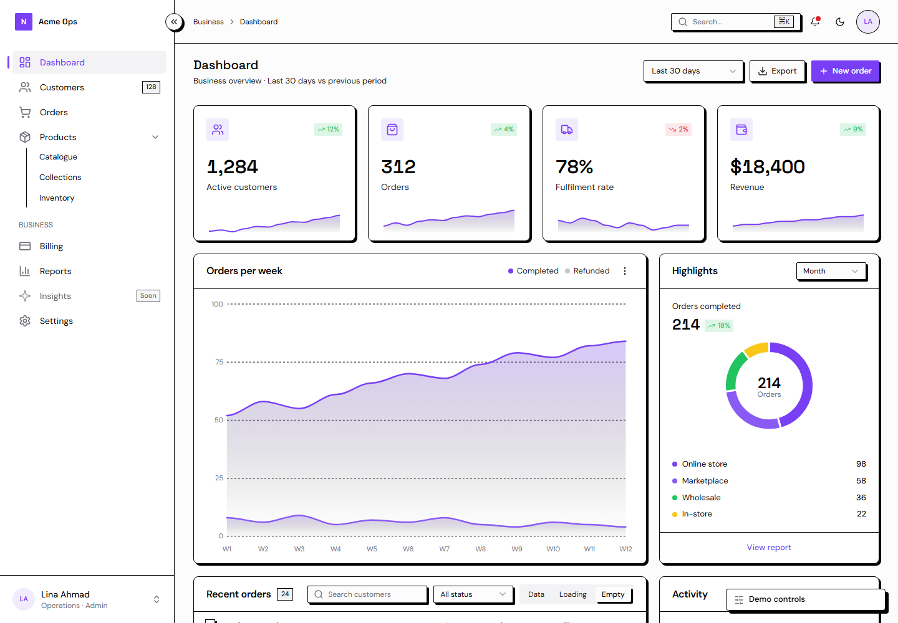
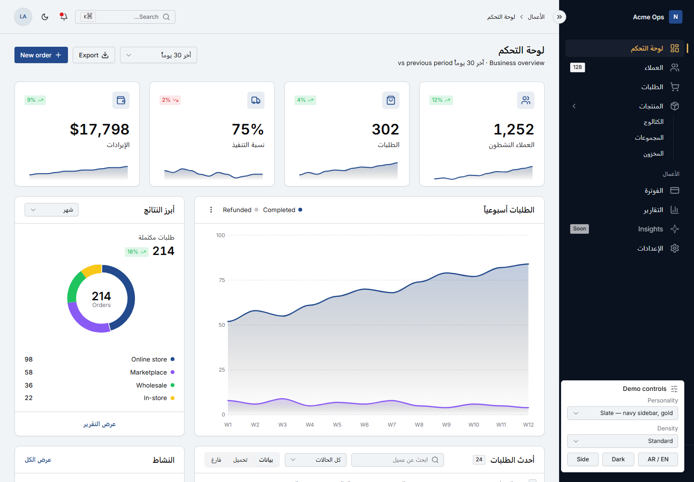

# jbelly-ui — UI design skill for AI agents

> **Public beta.** The system, recipes and scripts are complete and measured on a handful of briefs with one model family. What the beta tests is the claim that it works well in *every* agent and model. Try it on your own screens and report with the [issue templates](.github/ISSUE_TEMPLATE/); bad results are the most useful. Fork freely (MIT). Versions: [`CHANGELOG.md`](CHANGELOG.md).

[](https://github.com/mohammadJohar/jbelly-ui/actions/workflows/ci.yml) · MIT · Agent Skills format · Python 3.9+ tooling, no dependencies

**[Live demo](https://mohammadjohar.github.io/jbelly-ui/skills/jbelly-ui/assets/app-shell.html)** · [Landing page](https://mohammadjohar.github.io/jbelly-ui/) · [Cost, measured](COST.md) · [Comparison](comparison/) · [Roadmap](docs/roadmap.md)

**A licence-free UI system for web products, packaged as an agent skill.**
Dashboards, admin panels, settings and auth pages, data tables, landing
pages. Exact tokens and recipes, a spec-driven page builder, admin-grade
behaviours, licence-safe libraries, and a mandatory *personality* step so
every product looks deliberately different instead of default-AI generic.

Works with anything that renders HTML: plain HTML + Tailwind v4, React /
Next, Vue / Nuxt, Blazor, Laravel. Tokens are CSS variables; recipes are
utility class strings.



## Why

- **Commercial admin templates cost a licence per project** and their code
  and assets cannot be reused across products. This skill carries the
  *knowledge* those templates sell (tokens, sizes, layouts, complete page
  states, interaction behaviour) as instructions, with nothing copied.
- **AI-built UIs converge on the same look.** The personality step (type,
  palette, shape, density, surface, motion, signature element) is mandatory
  and written to a file per product, so two products never ship the same page.
- **Agent cost is Σ(context × steps).** The skill is built to be cheap:
  a 2K-token quick card, a zero-token scaffold, a JSON-spec page builder,
  and a one-call verifier. Measured on the same complex brief: **−51% tokens,
  −81% tool calls, −47% time** from v1 to v2 (`COST.md`).

## Install (three ways, one source)

**1. Agents that read skills** (Claude Code, Codex, Cursor, GitHub Copilot, Gemini CLI, Windsurf, Kiro, Roo Code, OpenCode, Amp, Goose and ~70 more):

```bash
npx skills add mohammadJohar/jbelly-ui -a claude-code     # or -a cursor, -a codex, -a copilot, -a gemini-cli …
npx skills add mohammadJohar/jbelly-ui -g -y              # user-wide, no prompts
```
No Node? `./install.sh cursor` (macOS/Linux) or `.\install.ps1 -Agent cursor` (Windows) copies the skill into the agent's folder; `docs/compatibility.md` lists every path.

**2. Tools that read a rules file** (Lovable and other AGENTS.md readers): copy `dist/AGENTS.md` to your project root (or into the tool's knowledge box).

**3. Chat-only tools** (ChatGPT, Gemini, Kimi, DeepSeek, a custom GPT or project): paste `dist/jbelly-ui-prompt.md` (about 5K tokens, self-contained, includes the tokens and a manual checklist).

Both `dist/` files are generated from the skill by `scripts/build_dist.py`, so they never drift from the source.

Then ask for any UI ("add a dashboard", "build the settings page", "restyle this table", "review this screen"). The skill triggers on UI work only.

## Try it in 30 seconds

Open the [live demo](https://mohammadjohar.github.io/jbelly-ui/skills/jbelly-ui/assets/app-shell.html) (or `skills/jbelly-ui/assets/app-shell.html` locally). The *Demo controls* panel in the corner switches personality, density, dark mode, sidebar style and AR/EN (RTL); everything in the page works: collapse, ⌘K palette, table states, drawer, sort, notifications. Or build a page from a spec:

```bash
python skills/jbelly-ui/scripts/build-screen.py skills/jbelly-ui/assets/spec.example.json out/dashboard.html
python skills/jbelly-ui/scripts/verify_page.py out/dashboard.html --variants ",#dark=1,#dir=rtl"   # render + console + lint + pre-flight
```

| Dark sidebar on a light page | Personality "neo", empty state | RTL |
|---|---|---|
|  |  |  |

## What is inside

`skills/jbelly-ui/` is the installable skill (what `npx skills add` copies). Everything else is evidence and tooling around it.

**The skill**

| Path | Purpose |
|------|---------|
| `SKILL.md` | The workflow, the system in one screen, the rules, the done list (about 4K tokens) |
| `references/quick-card.md` | One page: tokens, sizes, the 20 most-used recipes, cost rules. The only reference a standard screen needs |
| `references/personalities.md` | 8 dials, 6 presets, density block, how to derive a new one, the persisted file format |
| `references/tokens.css` | Drop-in tokens: light/dark roles, states, sidebar roles, radius scale, Tailwind v4 mapping, base resets |
| `references/components.md` · `layouts.md` · `patterns.md` | Exact class strings for 25 controls; shells, nav, toolbar, settings, auth, landing, RTL; KPI, chart, table, feed, drawer, pricing, checkout, palette, empty states |
| `references/charts.md` · `ux-behaviours.md` · `integrations.md` | ApexCharts theme from tokens + 8 recipes; loading/empty/error, tables, forms, overlays, keyboard, responsive; licence-safe libraries per need |
| `references/industry-playbooks.md` · `interface-guidelines.md` · `anti-patterns.md` · `review-rubric.md` · `stacks.md` · `sources.md` | Page inventories for 10 business types; exact-value interface rules; the AI-tells list; ten scored review dimensions; plain-CSS and React mappings; where every rule comes from |
| `assets/app-shell.html` | Self-contained demo and scaffold: shell, dark mode, RTL + i18n, density, personality switcher, table states, drawer, ⌘K palette, toasts, ApexCharts |
| `assets/spec.example.json` · `assets/tokens.json` | Example spec for the page builder; DTCG tokens for design tools |

**The scripts** (Python 3.9+, no dependencies; PowerShell twins where noted)

| Script | Does |
|--------|------|
| `personality_init.py` | Writes `design/personality.md` (design read + dials) so every product starts with its own look |
| `build-screen.py` | Whole screen from a ~2 KB JSON spec, zero model tokens for markup |
| `new_screen.py` (`new-screen.ps1`) | Scaffold copy with personality / density / RTL / dark preset |
| `verify_page.py` (`verify-page.ps1`) | One call: render variants headlessly, console errors, token lint, pre-flight, PASS/FAIL |
| `preflight.py` | Deterministic judgement: AI-default tells, structure checks, WCAG contrast of the token pairs |
| `lint_tokens.py` (`lint-tokens.ps1`) | No raw palette colours outside `tokens.css` |
| `audit_styles.py` | Redesign inventory: fonts, colours, radii, shadows, spacing, raw palette classes; deviation list in fix order |
| `export_tokens.py` · `build_dist.py` | Generate `assets/tokens.json` and the two `dist/` tiers from the sources |

**Around the skill**

| Path | Purpose |
|------|---------|
| `COST.md` | Measured token/time cost per screen and the levers that cut it |
| `comparison/` | The evaluation: two briefs, four candidates, deterministic grader and metrics, HTML report |
| `evals/` | 12 fixed briefs (incl. RTL Arabic, mobile, dark-first, empty states) and 24 trigger / no-trigger prompts |
| `dist/` | Generated delivery tiers: `AGENTS.md` (rules-file tools) and `jbelly-ui-prompt.md` (chat-only tools) |
| `docs/` | `compatibility.md` (agents, models, install paths), `roadmap.md`, showcase captures |
| `tests/smoke.py` · `.github/workflows/ci.yml` | What CI runs on every push: frontmatter limits, lint, pre-flight, dist drift, build + render + verify |

## What was tested, honestly

- Measured runs so far: one model family, in one agent, on the briefs in `comparison/` (see `COST.md`).
- Format-compatible but not yet measured: every other agent the `skills` CLI supports, and the two `dist/` tiers. The [roadmap](docs/roadmap.md) covers models, agents and blind human rating; results will replace this paragraph.

## Help test the beta

1. Install, ask your agent for a real screen, run `verify_page.py` and `preflight.py` on the result.
2. Open an issue with the template: brief, agent, model, verdict lines, screenshot.
3. Want to change something? `CONTRIBUTING.md` explains the layout, the tests (`python tests/smoke.py`) and the one rule that matters: nothing copied, every rule sourced.

## What the scripts touch

Every script is read-only except for the file it says it writes: `build-screen.py` and `new_screen.py` write the page you name, `personality_init.py` writes `design/personality.md`, `verify_page.py` writes screenshots to a folder you name (default: the OS temp folder), `export_tokens.py` and `build_dist.py` write into the skill's own `assets/` and `dist/`. Nothing calls a network API; the only network use is the page itself loading CDN scripts when rendered.

## Principles

1. Colour comes from semantic tokens; raw palette classes live in one file.
2. One primary action per view; cards are the unit of layout.
3. Every async region has loading, empty, error and success states.
4. Personality first: never ship the default look.
5. Only MIT / BSD / Apache / OFL dependencies; no template code, ever.
6. Read once, write once, verify once: the agent's cost is part of the design.

## Where the rules come from

Distilled from public, licence-free sources developers already trust:
shadcn/ui and Radix conventions, Shopify Polaris and GitHub Primer content
and data-table guidance, the Refactoring UI rules, Vercel's Web Interface
Guidelines, Linear-style keyboard and density patterns, Tremor/shadcn
dashboard blocks, and a study of the page inventories and flows of the
best-selling commercial templates in ten business categories. Nothing is
copied; every rule is restated as an instruction.

## Licence

MIT, see `LICENSE`. Fonts via Google Fonts (OFL), icons Lucide (ISC),
charts ApexCharts (MIT).
